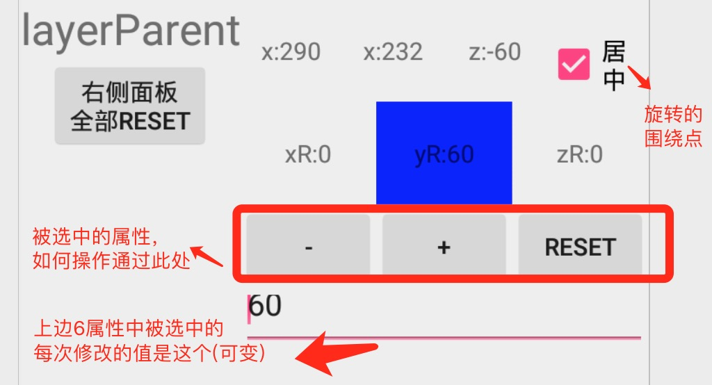

#3D库 demo使用介绍

>想法是AE的图层原理(我认为的~) (绑定父图层)；
>父变化,子跟着变化(旋转就是围绕父了)；
>子变化,父不变

### 下图每次操作都是以 动画的形式 表现出来的；



```
// iv.invalidate(Matrix matrix)
 iv.invalidate(
                Layer.setPivot(layerProperty.getX(), layerProperty.getY())
                        .relativeZPosition(layerProperty.getZ()) //位置 -1600+800=-800 围绕-1600 旋转
                        .rotationX(layerProperty.getxR())
                        .rotationY(layerProperty.getyR())
                        .rotationZ(layerProperty.getzR())
                        .attach(

                                LayerParent
                                        .location(layerParent_Property.getX(), layerParent_Property.getY(),
                                                layerParent_Property.getZ())
                                        .rotationX(layerParent_Property.getxR())
                                        .rotationY(layerParent_Property.getyR())
                                        .rotationZ(layerParent_Property.getzR())
                        ));
```