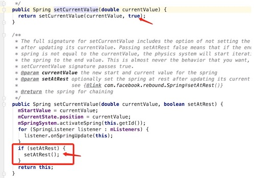
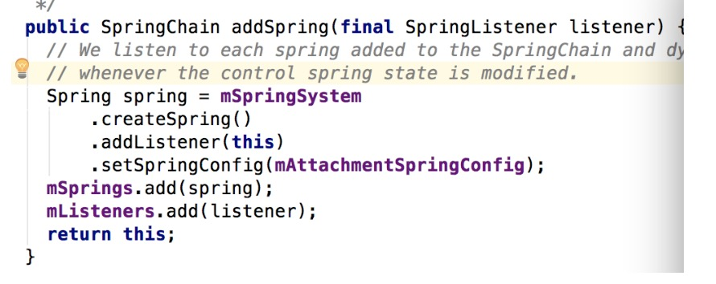
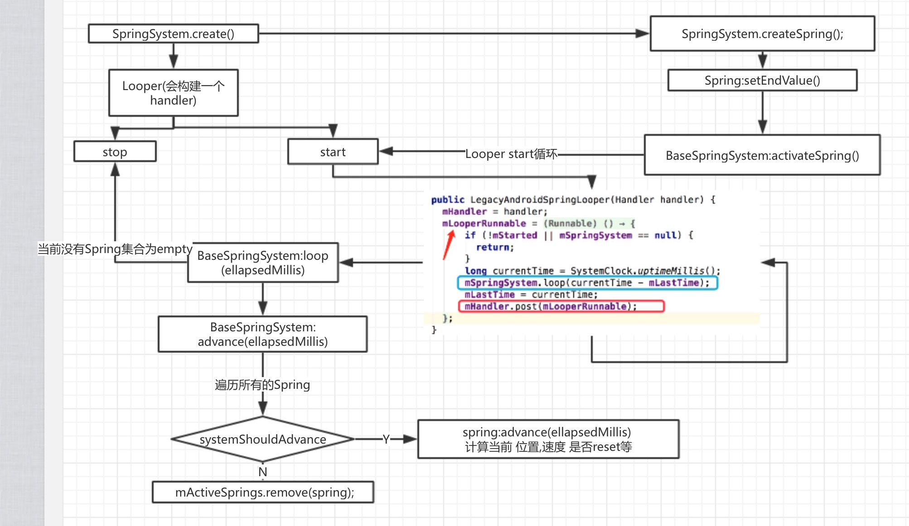

# Rebound的简单使用与源码分析
>综述：Rebound 通过胡克定律，实现的一个类似“弹簧”动画效果的第三方工具包。

[官方demo摘出](https://github.com/luhaoaimama1/ReboundDemo)

###单独使用
```
Spring spring =  SpringSystem.create().createSpring();
spring.addListener(new SimpleSpringListener() {
               @Override
               public void onSpringUpdate(Spring spring) {
                   super.onSpringUpdate(spring);
                   double currentValue = spring.getCurrentValue();
                   double valueMap = SpringUtil.mapValueFromRangeToRange(currentValue, 0, 1, 1, 0.5);
                   ViewHelper.setScaleX(siv, (float) valueMap);
                   ViewHelper.setScaleY(siv, (float) valueMap);
               }
           });
spring.setEndValue(1);//默认endValue是0；          
```

>Ps:SpringUtil.mapValueFromRangeToRange(currentValue, 0, 1, 1, 0.5);

> 是映射工具类 0->1的转映射到1->0.5

###监听
>SimpleSpringListener实现了SpringListener

```
public interface SpringListener {
  // 在首次开始运动时候调用。
  void onSpringActivate(Spring spring);
  //在advance后调用，表示状态更新。
  void onSpringUpdate(Spring spring);
  //在进入rest状态后调用。
  void onSpringAtRest(Spring spring);
  //则略有不同，仅在setEndValue中被调用，且该Spring需要在运动中且新的endValue不等于原endValue。
  void onSpringEndStateChange(Spring spring);
}
```

###配置
>拉力(tension) default:40--->拉力越大，弹簧效果越明显

>摩擦力(friction) default:7-->弹框效果阻力越大、越不明显

>Ps:如果这个摩擦力的值设置为0，就像真实世界中处于真空状态，一点摩擦力都没有，这个弹簧效果会一直无限制重复下去，根本停不下来

```
  spring.setSpringConfig(new SpringConfig(tensionValue, frictionValue));
```

###setEndValue与setCurrentValue的区别 
>end是一个值变化的过程,currentValue是表示插入一个值，表示一个瞬间(因为reset了~)；

>Ps:setAtRest()会让他停止动画；



###连锁动画

```
SpringChain mSpringChain = SpringChain.create();
mSpringChain.addSpring(new SimpleSpringListener(){});
mSpringChain.setControlSpringIndex(2).getControlSpring().setEndValue(0);
```
* SpringChain这个类，创建它有两个create方法：
    * 默认无参数create()
    * 有参数的create(int mainTension,int mainFriction,int attachmentTension,int attachmentFriction)
        >mainTension:主导spring的拉力系数，mainFriction:主导Spring的摩擦力系数，
        
        >attachmentTensio,attachmentFriction:表示附属的拉力和摩擦力系数
        
>SpringChain需要设置一个起主导控制作用的Spring，通过setControlSpringIndex方法来设置

>getControlSpring()则代表 获得主导的Spring

>addSpring 里其实直接new了.  通过mSpringChain.getAllSprings()可以获取到注册到mSpringChain里的所有Spring




###简单的源码流程分析图


# Reference&Thanks：

http://blog.csdn.net/hanhailong726188/article/details/50687466

http://www.jianshu.com/p/9d56d92d337c